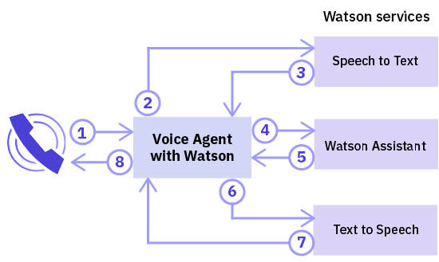
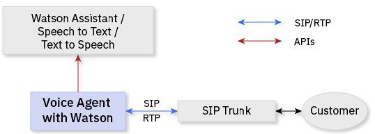

---

copyright:
  years: 2017, 2018
lastupdated: "2018-06-13"

---

{:shortdesc: .shortdesc}
{: new_window: target="_blank"}
{:codeblock: .codeblock}
{:pre: .pre}
{:screen: .screen}
{:tip: .tip}

# About Voice Agent with Watson
{: #about}

{{site.data.keyword.iva_full}} enables direct, automated voice interactions over the telephone between a cognitive voice agent and your customers. With Watson artificial intelligence at its backbone, your voice agent can communicate in a more conversational manner, and it can handle complex interactions that are difficult for traditional interactive voice response (IVR) systems.
{: shortdesc}

## Architecture
{: #architecture}

{{site.data.keyword.iva_short}} is one of several components in the overall architecture of your environment, which can include the following elements:

* A voice agent based on [IBM Voice Gateway ](https://www.ibm.com/support/knowledgecenter/SS4U29/), which orchestrates the following Watson services:
  * [{{site.data.keyword.speechtotextshort}} ](https://console.bluemix.net/docs/services/speech-to-text/index.html): Converts the caller's audio into text
  * [{{site.data.keyword.conversationshort}} ](https://console.bluemix.net/docs/services/conversation/index.html) or [{{site.data.keyword.virtualagentshort}} ](https://console.bluemix.net/docs/services/virtual-agent/getting-started.html#getting-started): Analyzes the text, maps it to intents, and provides a response according to a dialog that you create
  * [{{site.data.keyword.texttospeechshort}} ](https://console.bluemix.net/docs/services/text-to-speech/index.html): Converts the response into voice audio
* A SIP trunk, which connects your voice agent to the telephone network
* An optional service orchestration engine (SOE), which sits between the {{site.data.keyword.conversationshort}} service and your voice agent so that you can further customize your environment

### Watson service orchestration
{: #watson}

The following diagram shows how {{site.data.keyword.iva_short}} orchestrates the various Watson services to create a voice agent. Within seconds, utterances flow between the services to result in a natural-sounding conversation with the caller.

The following steps outline the conversation flow.

1. The caller asks a question.
1. The question is streamed to the {{site.data.keyword.speechtotextshort}} service.
1. A text utterance is returned.
1. The text is sent to the {{site.data.keyword.conversationshort}} service or {{site.data.keyword.virtualagentshort}} as a message request.
1. A message response is returned.
1. The response text is sent to the {{site.data.keyword.texttospeechshort}} service.
1. Synthesized audio is returned.
1. {{site.data.keyword.iva_short}} streams the audio response to the caller.

### Architecture with a SIP trunk
{: #arch-sip}

You can use SIP trunks to quickly set up and test your environment from the public telephone network. When you connect to a voice agent through a SIP trunk, you must configure your SIP trunk to forward INVITE requests to the voice agent based on its IP address. You can find your {{site.data.keyword.iva_short}} server IP address on the _Getting started_ page.

### Architecture with a service orchestration engine
{: #arch-soe}

When you configure the {{site.data.keyword.conversationshort}} service, you can include a service orchestration engine (SOE) to customize the communication between {{site.data.keyword.iva_short}} and the service. The service orchestration engine acts as a proxy for the {{site.data.keyword.conversationshort}} service, by intercepting message requests and responses and modifying them by using third-party APIs. {{site.data.keyword.iva_short}} and the {{site.data.keyword.conversationshort}} service communicate through the {{site.data.keyword.conversationshort}} service's REST API, sending request data by using the `MessageRequest` method and receiving a corresponding JSON response. You can also use an SOE as a proxy for {{site.data.keyword.virtualagentshort}}, where it acts in the same way.

You might want to incorporate a service orchestration engine in your {{site.data.keyword.iva_full_notm}} deployment for the following reasons:

* To de-identify requests and remove personal information such as PHI, PII, and PCI before it is sent to the {{site.data.keyword.conversationshort}} service
* To personalize responses from the {{site.data.keyword.conversationshort}} service, for example by using customer location information to provide a personal weather forecast
* To enable telephony features, such as including caller ID or collecting DTMF digits for account numbers
* To customize interactions with customers by using APIs
* To integrate voice security by using DTMF or biometrics

To learn more about how to implement a service orchestration engine, see the [service orchestration engine samples on GitHub ](https://github.com/WASdev/sample.voice.gateway/tree/master/soe){: new_window}. It's recommended that you secure your service orchestration engine with a user name and password.

## Features
{: #features}

* **Barge-in:** Callers can interrupt Watson if the utterance Watson is sending to the caller is not relevant to the context of the conversation.
* **Call hang-up:** The voice agent can be signaled to end a call from the {{site.data.keyword.conversationshort}} service by setting an action tag.
* **Music on hold:** The voice agent can play an audio file that is specified by the {{site.data.keyword.conversationshort}} for some period or until processing in the {{site.data.keyword.conversationshort}} completes.
* **SSML tagging:** Speech Synthesis Markup Language (SSML) tags are used to control how {{site.data.keyword.texttospeechshort}} synthesizes utterances into audio. {{site.data.keyword.iva_short}} supports passing these tags through to {{site.data.keyword.texttospeechshort}} when received from the {{site.data.keyword.conversationshort}} service.
* **DTMF support:** {{site.data.keyword.iva_short}} supports [RFC 4733 ](https://tools.ietf.org/html/rfc4733), RTP Payload for DTMF Digits, Telephony Tones, and Telephony Signals. Dual-tone multi-frequency (DTMF) signals are converted into single digit text utterances that are sent to the Watson services.

## Supported languages
{: #supported-languages}

For a language to be supported, it must be supported by all Watson services that you configure in your voice agent. Using the {{site.data.keyword.speechtotextshort}} and {{site.data.keyword.texttospeechshort}} services and either {{site.data.keyword.conversationshort}} or {{site.data.keyword.virtualagentshort}}, the following languages are supported:

* Brazilian Portuguese
* Japanese
* Spanish
* UK English
* US English

## Supported protocols
{: #supported-protocols}

* **SIP:** The voice agent supports connecting to Watson as if it were a SIP endpoint via a SIP trunk, from an enterprise session border controller (SBC), or from a multipoint control unit (MCU).
* **RTP:** The Real-time Transport Protocol (RTP) is supported for audio media streams.
* **G.711:** The voice agent supports U-law and A-law G.711 audio. Other audio protocols, such as G.723 or G.729, are not currently supported.
