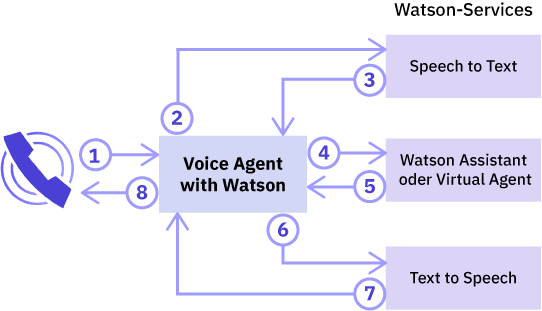
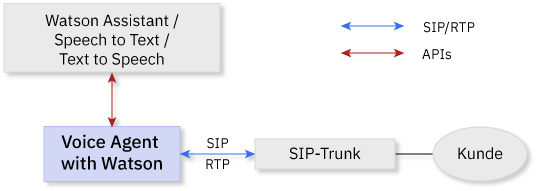
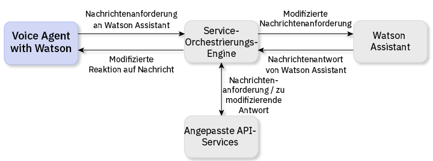

---

copyright:
  years: 2017, 2018
lastupdated: "2018-06-13"

---

{:shortdesc: .shortdesc}
{: new_window: target="_blank"}
{:codeblock: .codeblock}
{:pre: .pre}
{:screen: .screen}
{:tip: .tip}

# Informationen zu Voice Agent with Watson
{: #about}

{{site.data.keyword.iva_full}} ermöglicht direkte, automatisierte Sprachinteraktionen über das Telefon zwischen einem kognitiven Sprachagenten und Ihren Kunden. Mit der künstlichen Intelligenz von Watson als Backbone kann Ihr Sprachagent dialogorientierter kommunizieren und komplexe Interaktionen verarbeiten, die für herkömmliche interaktive Sprachsteuerungssysteme (IVR-Systeme, "Interactive Voice Response") nur schwer zu bewältigen wären.
{: shortdesc}

## Architektur
{: #architecture}

{{site.data.keyword.iva_short}} ist eine von mehreren Komponenten in der Gesamtarchitektur Ihrer Umgebung, die folgende Elemente beinhalten kann:

* Ein Sprachagent auf Basis von [IBM Voice Gateway ](https://www.ibm.com/support/knowledgecenter/SS4U29/), der die folgenden Watson-Services koordiniert:
  * [{{site.data.keyword.speechtotextshort}} ](https://console.bluemix.net/docs/services/speech-to-text/index.html): wandelt den Ton des Anrufers in Text um
  * [{{site.data.keyword.conversationshort}} ](https://console.bluemix.net/docs/services/conversation/index.html) oder [{{site.data.keyword.virtualagentshort}} ](https://console.bluemix.net/docs/services/virtual-agent/getting-started.html#getting-started): Analysiert den Text, ordnet ihn Absichten zu und stellt eine Antwort entsprechend dem von Ihnen erstellten Dialog bereit
  * [{{site.data.keyword.texttospeechshort}} ](https://console.bluemix.net/docs/services/text-to-speech/index.html): Wandelt die Antwort in Sprachton um
* Ein SIP-Trunk, der Ihren Sprachagenten mit dem Telefonnetz verbindet
* Eine optionale Service-Orchestrierungsengine (SOE), die sich zwischen dem {{site.data.keyword.conversationshort}}-Service und Ihrem Sprachagenten befindet, sodass Sie Ihre Umgebung weiter anpassen können

### Orchestrierung des Watson-Service
{: #watson}

Das folgende Diagramm zeigt, wie {{site.data.keyword.iva_short}} die unterschiedlichen Watson-Services koordiniert, um einen Sprachagenten zu erstellen. Innerhalb von Sekunden fließen verbale Äußerungen zwischen den Services, was zu einem gut verständlichen Dialog mit dem Anrufer führt.

Die folgenen Schritte veranschaulichen den Ablauf eines Dialogs.

1. Der Anrufer stellt eine Frage.
1. Die Frage wird an den {{site.data.keyword.speechtotextshort}}-Service gestreamt.
1. Eine Textäußerung wird zurückgegeben.
1. Der Text wird als Nachrichtenanforderung an den {{site.data.keyword.conversationshort}}-Service oder an {{site.data.keyword.virtualagentshort}} gesendet.
1. Eine Reaktion auf die Nachricht wird zurückgegeben.
1. Der Antworttext wird an den {{site.data.keyword.texttospeechshort}}-Service gesendet.
1. Synthetisch erstellter Ton wird zurückgegeben.
1. {{site.data.keyword.iva_short}} streamt die Sprachausgabe an den Anrufer.

### Architektur mit einem SIP-Trunk
{: #arch-sip}

Mit SIP-Trunks können Sie Ihre Umgebung über das öffentliche Telefonnetz umgehend einrichten und testen. Wenn Sie über einen SIP-Trunk eine Verbindung zu einem Sprachagenten herstellen, müssen Sie Ihren SIP-Trunk so konfigurieren, dass INVITE-Anforderungen an den Sprachagenten auf Basis seiner IP-Adresse weitergeleitet werden. Die IP-Adresse Ihres {{site.data.keyword.iva_short}}-Servers finden Sie auf der Seite _Einführung_.

### Architektur mit einer Service-Orchestrierungsengine
{: #arch-soe}

Wenn Sie den {{site.data.keyword.conversationshort}}-Service konfigurieren, können Sie eine Service-Orchestrierungsengine (SOE) für die Anpassung der Kommunikation zwischen {{site.data.keyword.iva_short}} und dem Service integrieren. Die Service-Orchestrierungsengine agiert als Proxy für den {{site.data.keyword.conversationshort}}-Service, indem sie Nachrichtenanforderungen und Antworten abfängt und sie mithilfe von APIs von Drittanbietern modifiziert. {{site.data.keyword.iva_short}} und der {{site.data.keyword.conversationshort}}-Service kommunizieren über die REST-API des {{site.data.keyword.conversationshort}}-Service, wobei sie mittels der `MessageRequest`-Methode Anforderungsdaten senden und eine entsprechende JSON-Antwort empfangen. Sie können eine SOE auch als Proxy für {{site.data.keyword.virtualagentshort}} nutzen, wo sie in gleicher Weise agiert.

Folgende Gründe können für die Einbindung einer Service-Orchestrierungsengine in Ihre {{site.data.keyword.iva_full_notm}}-Bereitstellung sprechen:

* Anonymisieren von Anforderungen und Entfernen von personenbezogenen Daten wie persönlich identifizierbaren Daten (Personally Identifiable Information, PII), geschützten Gesundheitsinformationen (Protected Health Information, PHI) und Zahlungskarteninformationen (Payment Card Industry Data Security Standard, PCI DSS), bevor sie an den {{site.data.keyword.conversationshort}}-Service gesendet werden
* Personalisieren der Antworten vom {{site.data.keyword.conversationshort}}-Service, z. B. unter Verwendung von Daten zum Kundenstandort, um eine persönliche Wettervorhersage anbieten zu können
* Ermöglichen von Telefoniefunktionen, z. B. Einbeziehen der Anrufer-ID oder Sammeln von DTMF-Ziffern für Kontonummern
* Anpassen von Interaktionen an Kunden unter Verwendung von APIs
* Integration von Schutzfunktionen für die Sprachsteuerung mithilfe von DTMF oder biometrischen Angaben

Weitere Informationen zur Vorgehensweise beim Implementieren einer Service-Orchestrierungsengine finden Sie unter [Beispiele für Service-Orchestrierungsengine auf GitHub ](https://github.com/WASdev/sample.voice.gateway/tree/master/soe){: new_window}.

**Wichtig**: Aus Gründen der Datensicherheit müssen Sie sicherstellen, dass Sie für Ihren SOE-Arbeitsbereich eine sichere URL verwenden. Verwenden Sie `https:` anstelle von `http:` sowie obligatorische Authentifizierung. Weitere Informationen zu Sicherheitsaspekten finden Sie unter [Informationssicherheit und Datenschutz](infosec.html). 

## Features
{: #features}

* **Einsprechen (in eine laufende Bandansage):** Der Anrufer kann Watson unterbrechen, wenn die Äußerungen, die Watson an den Anrufer sendet, im Kontext des Dialogs nicht relevant sind.
* **Beenden des Anrufs:** Dem Sprachagenten kann mit einem Signal mitgeteilt werden, dass er einen Anruf vom {{site.data.keyword.conversationshort}}-Service abbrechen soll, indem ein Aktionstag festgelegt wird.
* **Warteschleifenmusik:** Der Sprachagent kann über einen bestimmten Zeitraum oder bis zum Ende der Verarbeitung in {{site.data.keyword.conversationshort}} eine vom {{site.data.keyword.conversationshort}} angegebene Audiodatei abspielen.
* **SSML-Tagging:** Mit SSML (Speech Synthesis Markup Language)-Tags kann gesteuert werden, wie {{site.data.keyword.texttospeechshort}} aus Äußerungen synthetisch Ton erstellt. {{site.data.keyword.iva_short}} unterstützt die Weiterleitung dieser Tags zu {{site.data.keyword.texttospeechshort}}, sobald diese vom {{site.data.keyword.conversationshort}}-Service erhalten werden.
* **DTMF-Unterstützung:** {{site.data.keyword.iva_short}} unterstützt [RFC 4733 ](https://tools.ietf.org/html/rfc4733), RTP-Nutzdaten aus DTMF-Ziffern, Telefonietöne und -signale. DTMF (Dual-Tone Multi-Frequency)-Signale werden in einziffrige Textäußerungen umgewandelt, die an die Watson-Service gesendet werden.

## Unterstützte Sprachen
{: #supported-languages}

Eine Sprache kann nur unterstützt werden, wenn Sie von allen Watson-Service unterstützt wird, die Sie in Ihrem Sprachagenten konfigurieren. Unter Verwendung des {{site.data.keyword.speechtotextshort}}- und des {{site.data.keyword.texttospeechshort}}-Service sowie entweder {{site.data.keyword.conversationshort}} oder {{site.data.keyword.virtualagentshort}} werden die folgenden Sprachen unterstützt:

* Portugiesisch (Brasilien)
* Japanisch
* Spanisch
* Englisch (GB)
* Englisch (US)

## Unterstützte Protokolle
{: #supported-protocols}

* **SIP:** Der Sprachagent unterstützt die Verbindung zu Watson, als sei dieser ein SIP-Endpunkt, über einen SIP-Trunk, ausgehend von einem SBC (Session Border Controller) oder von einer MCU (Multipoint Control Unit).
* **RTP:** Das Real-Time Transport Protocol (RTP) wird für Audio-Media-Streams unterstützt.
* **G.711:** Der Sprachagent unterstützt die Digitalisierung von Audiosignalen nach der Richtlinie G.711 sowohl im U-law- als auch im A-law-Verfahren. Andere Audioprotokolle wie G.723 oder G.729 werden derzeit nicht unterstützt.
