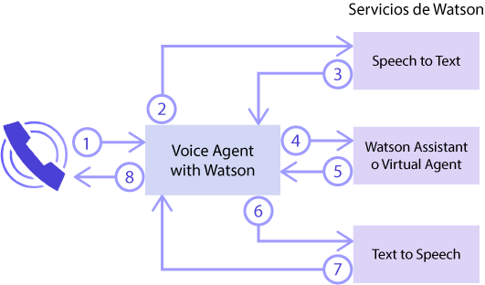
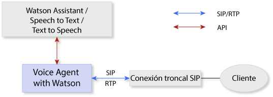
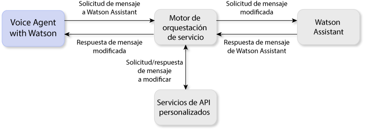

---

copyright:
  years: 2017, 2018
lastupdated: "2018-06-13"

---

{:shortdesc: .shortdesc}
{: new_window: target="_blank"}
{:codeblock: .codeblock}
{:pre: .pre}
{:screen: .screen}
{:tip: .tip}

# Acerca de Voice Agent with Watson
{: #about}

{{site.data.keyword.iva_full}} permite interacciones de voz directas y automatizadas por teléfono entre sus clientes y un agente de voz cognitivo. Con la inteligencia artificial de Watson como eje central, el agente de voz puede comunicarse de forma más conversacional y manejar interacciones complejas difíciles para los sistemas tradicionales de respuesta de voz interactiva (IVR).
{: shortdesc}

## Arquitectura
{: #architecture}

{{site.data.keyword.iva_short}} es uno de los diversos componentes de la arquitectura general de su entorno, que puede incluir los siguientes elementos:

* Un agente de voz basado en [IBM Voice Gateway ](https://www.ibm.com/support/knowledgecenter/SS4U29/), que organiza los servicios siguientes de Watson:
  * [{{site.data.keyword.speechtotextshort}} ](https://console.bluemix.net/docs/services/speech-to-text/index.html): Convierte el audio del interlocutor en texto
  * [{{site.data.keyword.conversationshort}} ](https://console.bluemix.net/docs/services/conversation/index.html) o [{{site.data.keyword.virtualagentshort}} ](https://console.bluemix.net/docs/services/virtual-agent/getting-started.html#getting-started): Analiza el texto, lo correlaciona con intenciones y proporciona una respuesta según un diálogo que usted crea
  * [{{site.data.keyword.texttospeechshort}} ](https://console.bluemix.net/docs/services/text-to-speech/index.html): Convierte la respuesta en audio de voz
* Una conexión troncal SIP, que conecta el agente de voz a la red telefónica
* Un motor de orquestación de servicio (SOE) opcional, que se encuentra entre el servicio {{site.data.keyword.conversationshort}} y el agente de voz, de modo que puede personalizar más el entorno

### Orquestación de servicios de Watson
{: #watson}

El diagrama siguiente muestra cómo {{site.data.keyword.iva_short}} organiza los diversos servicios de Watson para crear un agente de voz. En cuestión de segundos, las expresiones fluyen entre los servicios para dar como resultado una conversación natural con el interlocutor.

En los pasos siguientes se describe el flujo de conversación.

1. El interlocutor formula una pregunta.
1. La pregunta se transmite al servicio {{site.data.keyword.speechtotextshort}}.
1. Se devuelve una expresión de texto.
1. El texto se envía al servicio {{site.data.keyword.conversationshort}} o a {{site.data.keyword.virtualagentshort}} como una solicitud de mensaje.
1. Se devuelve una respuesta de mensaje.
1. El texto de respuesta se envía al servicio {{site.data.keyword.texttospeechshort}}.
1. Se devuelve un audio sintetizado.
1. {{site.data.keyword.iva_short}} transmite la respuesta de audio al interlocutor.

### Arquitectura con una conexión troncal SIP
{: #arch-sip}

Puede utilizar conexiones troncales SIP para configurar y probar rápidamente el entorno desde la red telefónica pública. Cuando se conecta a un agente de voz a través de una conexión troncal SIP, debe configurar la conexión troncal SIP para reenviar solicitudes INVITE al agente de voz en función de su dirección IP. Encontrará la dirección IP del servidor de {{site.data.keyword.iva_short}} en la página _Iniciación_.

### Arquitectura con un motor de orquestación de servicio
{: #arch-soe}

Al configurar el servicio {{site.data.keyword.conversationshort}}, puede incluir un motor de orquestación de servicio (SOE) para personalizar la comunicación entre {{site.data.keyword.iva_short}} y el servicio. El motor de orquestación de servicio actúa como un proxy para el servicio {{site.data.keyword.conversationshort}} interceptando las solicitudes y respuestas de mensaje y las modifica mediante API de terceros. {{site.data.keyword.iva_short}} y el servicio {{site.data.keyword.conversationshort}} se comunican mediante la API REST del servicio {{site.data.keyword.conversationshort}}; envían datos de solicitud mediante el método `MessageRequest` y reciben una respuesta JSON correspondiente. También puede utilizar un SOE como proxy para {{site.data.keyword.virtualagentshort}}, donde actúa de la misma forma.

Puede que desee incorporar un motor de orquestación de servicio en el despliegue de {{site.data.keyword.iva_full_notm}} por las siguientes razones:

* Para desidentificar las solicitudes y eliminar la información personal, como información sanitaria personal, información de identificación personal e información de la industria de tarjetas de pago antes de que se envíe al servicio {{site.data.keyword.conversationshort}}
* Para personalizar las respuestas del servicio {{site.data.keyword.conversationshort}}, por ejemplo mediante la información de ubicación del cliente para proporcionar una previsión meteorológica personal
* Para habilitar características de telefonía, como incluir un ID de llamada entrante o recopilar dígitos DTMF para números de cuenta
* Para personalizar las interacciones con los clientes mediante API
* Para integrar la seguridad de voz mediante DTMF o biométrica

Para obtener más información sobre cómo implementar un motor de orquestación de servicio, consulte los [ejemplos de motor de orquestación de servicio en GitHub ](https://github.com/WASdev/sample.voice.gateway/tree/master/soe){: new_window}.

**Importante**: Para la seguridad de datos, asegúrese de utilizar un URL seguro para el espacio de trabajo de SOE, utilizando `https:` en lugar de `http:`, y solicite autenticación. Consulte [Seguridad de información y privacidad de datos](infosec.html) para obtener más información sobre las consideraciones de seguridad.

## Características
{: #features}

* **Interferir:** Los interlocutores pueden interrumpir a Watson si la expresión que les envía Watson no es relevante para el contexto de la conversación.
* **Colgar la llamada:** Se puede indicar al agente de voz que finalice una llamada desde el servicio {{site.data.keyword.conversationshort}} estableciendo una etiqueta de acción.
* **Música en espera:** El agente de voz puede reproducir un archivo de audio que se especifica en la {{site.data.keyword.conversationshort}} durante un determinado periodo o hasta que finaliza el proceso en {{site.data.keyword.conversationshort}}.
* **Etiquetas SSML:** Las etiquetas SSML (lenguaje de códigos de síntesis de voz) se utilizan para controlar cómo {{site.data.keyword.texttospeechshort}} sintetiza las expresiones en audio. {{site.data.keyword.iva_short}} admite que estas etiquetas se pasen a {{site.data.keyword.texttospeechshort}} cuando se reciben desde el servicio {{site.data.keyword.conversationshort}}.
* **Soporte para DTMF:** {{site.data.keyword.iva_short}} admite [RFC 4733 ](https://tools.ietf.org/html/rfc4733), carga útil de RTP para dígitos DTMF, tonos de telefonía y señales de telefonía. Las señales DTMF (multifrecuencia de tono dual) se convierten en expresiones de texto de un solo dígito que se envían a los servicios de Watson.

## Idiomas admitidos
{: #supported-languages}

Para que se admita un idioma, debe estar admitido en todos los servicios de Watson que configure en el agente de voz. Se admiten los idiomas siguientes en el uso de los servicios {{site.data.keyword.speechtotextshort}} y {{site.data.keyword.texttospeechshort}} y de {{site.data.keyword.conversationshort}} o {{site.data.keyword.virtualagentshort}}:

* Portugués de Brasil
* Japonés
* Español
* Inglés de Reino Unido
* Inglés de Estados Unidos

## Protocolos admitidos
{: #supported-protocols}

* **SIP:** El agente de voz permite conectarse a Watson como si fuera un punto final SIP a través de una conexión troncal SIP, desde un controlador de límite de sesión (SBC) empresarial o desde una unidad de control multipunto (MCU).
* **RTP:** El protocolo Real-time Transport Protocol (RTP) está admitido para series de medios de audio.
* **G.711:** El agente de voz admite audio U-law y A-law G.711. Actualmente, no se admiten otros protocolos de audio, como G.723 o G.729.
