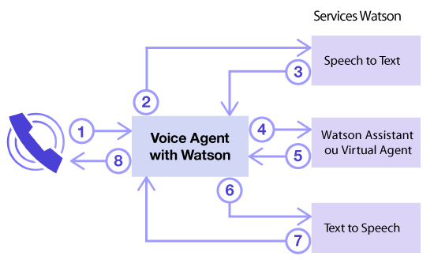
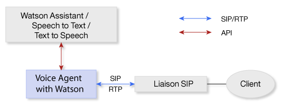
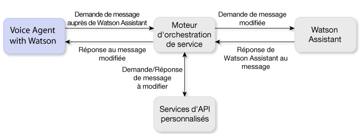

---

copyright:
  years: 2017, 2018
lastupdated: "2018-11-06"

---

{:shortdesc: .shortdesc}
{: new_window: target="_blank"}
{:codeblock: .codeblock}
{:pre: .pre}
{:screen: .screen}
{:tip: .tip}

# A propos de Voice Agent with Watson
{: #about}

{{site.data.keyword.iva_full}} permet des interactions vocales automatisées directes via un appel téléphonique entre un agent vocal cognitif et vos clients. Avec l'intelligence artificielle Watson au niveau du réseau principal, votre agent vocal est capable de communiquer sur un mode plus conversationnel et peut gérer des interactions complexes difficiles pour des serveurs vocaux interactifs classiques.
{: shortdesc}

## Architecture
{: #architecture}

{{site.data.keyword.iva_short}} est l'un des différents composants de l'architecture globale de votre environnement, à savoir :

* Un agent vocal basé sur [IBM Voice Gateway ](https://www.ibm.com/support/knowledgecenter/SS4U29/), qui orchestre les services Watson suivants :
  * [{{site.data.keyword.speechtotextshort}} ](../speech-to-text/index.html) : Convertit l'audio de l'appelant en texte
  * [{{site.data.keyword.conversationshort}} ](../conversation/index.html) : Analyse le texte, le mappe à des intentions et fournit une réponse en fonction d'un dialogue que vous créez
  * [{{site.data.keyword.texttospeechshort}} ](../text-to-speech/index.html) : Convertit la réponse en audio vocal
* Une liaison SIP, qui connecte votre agent vocal au réseau téléphonique
* Un moteur d'orchestration de service facultatif, situé entre le service {{site.data.keyword.conversationshort}} et votre agent vocal vous permettant de personnaliser encore davantage votre environnement

### Orchestration du service Watson
{: #watson}

Le diagramme suivant montre comment {{site.data.keyword.iva_short}} orchestre les différents services Watson pour créer un agent vocal. En quelques secondes, les énoncés circulent entre les services, pour se traduire par une conversation naturelle avec l'appelant.

Les étapes suivantes décrivent le flux de conversion :

1. L'appelant pose une question.
1. La question est diffusée au service {{site.data.keyword.speechtotextshort}}.
1. Un énoncé de texte est retourné.
1. Le texte est envoyé au service {{site.data.keyword.conversationshort}} en tant que demande de message.
1. Une réponse au message est retournée.
1. Le texte de réponse est envoyé au service {{site.data.keyword.texttospeechshort}}.
1. Une version audio synthétisée est retournée.
1. {{site.data.keyword.iva_short}} diffuse la réponse audio à l'appelant.

### Architecture avec une liaison SIP
{: #arch-sip}

Vous pouvez utiliser des liaisons SIP pour rapidement configurer et tester votre environnement depuis le réseau téléphonique public. Lors de la connexion à un agent vocal via une liaison SIP, vous devez configurer votre liaison SIP pour qu'elle réachemine les demandes INVITE vers l'agent vocal en fonction de son adresse IP. L'adresse IP de votre serveur {{site.data.keyword.iva_short}} figure sur la page _Initiation_.

### Architecture avec un moteur d'orchestration de service
{: #arch-soe}

Lorsque vous configurez le service {{site.data.keyword.conversationshort}}, vous pouvez inclure un moteur d'orchestration de service pour personnaliser la communication entre {{site.data.keyword.iva_short}} et le service. Le moteur d'orchestration de service fait office de proxy pour le service {{site.data.keyword.conversationshort}}, en interceptant les demandes de message et les réponses aux messages et en les modifiant via des API tierces. {{site.data.keyword.iva_short}} et le service {{site.data.keyword.conversationshort}} communiquent via l'API REST du service {{site.data.keyword.conversationshort}}, en envoyant des données de demande via la méthode `MessageRequest` et en recevant une réponse JSON correspondante.

Vous souhaiterez peut-être incorporer un moteur d'orchestration de service dans votre déploiement {{site.data.keyword.iva_full_notm}} dans les circonstances suivantes :

* Pour annuler l'identification de demandes et retirer des informations personnelles, telles que PHI, PII et PCI, avant leur envoi au service {{site.data.keyword.conversationshort}}
* Pour personnaliser des réponses du service {{site.data.keyword.conversationshort}} (par exemple, en utilisant des informations sur l'emplacement du consommateur pour lui soumettre des prévisions météorologiques personnalisées)
* Pour activer des fonctionnalités téléphoniques, comme l'identification d'appel ou le déchiffrage des numérotations DTMF pour les numéros de compte
* Pour personnalisation des interactions avec les clients via des API
* Pour intégrer la sécurité par identification de la voix DTMF ou des données biométriques

Pour plus d'informations sur l'implémentation d'un moteur d'orchestration de service, voir les [exemples de moteur d'orchestration de service sur GitHub ](https://github.com/WASdev/sample.voice.gateway/tree/master/soe){: new_window}.

**Important** : pour la sécurité des données, veillez à utiliser une URL sécurisée pour votre espace de travail de moteur d'orchestration de service, en utilisant `https:` au lieu de `http:`, et exigez une authentification. Voir [Sécurité des informations et confidentialité des données](infosec.html) pour en savoir plus sur les éléments à prendre en compte en matière de sécurité.

## Fonctions
{: #features}

* **Interruption :** Un appelant peut interrompre Watson si l'énoncé que Watson envoie à l'appelant ne correspond pas au contexte de la conversation.
* **Fin d'appel :** L'agent vocal peut recevoir le signal lui demandant de terminer un appel depuis le service {{site.data.keyword.conversationshort}} à l'aide d'une balise d'action.
* **Musique d'attente :** L'agent vocal peut lire un fichier audio spécifié par {{site.data.keyword.conversationshort}} pendant une certaine période ou jusqu'à ce que le traitement dans {{site.data.keyword.conversationshort}} soit terminé.
* **Balisage SSML :** Les balises SSML (Speech Synthesis Markup Language) sont utilisées pour contrôler la façon dont {{site.data.keyword.texttospeechshort}} synthétise les énoncés en son. {{site.data.keyword.iva_short}} prend en charge la transmission de ces balises jusqu'à {{site.data.keyword.texttospeechshort}} lorsqu'elles sont reçues du service {{site.data.keyword.conversationshort}}.
* **Support DTMF : ** {{site.data.keyword.iva_short}} prend en charge [RFC 4733 ](https://tools.ietf.org/html/rfc4733), RTP Payload for DTMF Digits, Telephony Tones et Telephony Signals. Les signaux de fréquence vocale (DTMF) sont convertis en énoncés texte à un seul chiffre qui sont envoyés aux services Watson.

## Langues prises en charge
{: #supported-languages}

Pour qu'une langue soit prise en charge, elle doit être prise en charge par tous les services Watson que vous configurez dans votre agent vocal. Avec les services {{site.data.keyword.speechtotextshort}}, {{site.data.keyword.texttospeechshort}} et {{site.data.keyword.conversationshort}}, les langues suivantes sont prises en charge :

* Portugais brésilien
* Français ({{site.data.keyword.speechtotextshort}} large bande uniquement)
* Allemand ({{site.data.keyword.speechtotextshort}} large bande uniquement)
* Japonais
* Espagnol
* Anglais (Royaume Uni)
* Anglais (Etats-Unis)

## Protocoles pris en charge
{: #supported-protocols}

* **SIP :** L'agent vocal prend en charge la connexion à Watson comme s'il s'agissait d'un point de terminaison SIP via une liaison SIP depuis un contrôleur SBC d'entreprise ou depuis une unité de contrôle multipoint (MCU).
* **RTP :** Le protocole RTP (Real-time Transport Protocol) est pris en charge pour les flux média audio.
* **G.711 :** L'agent vocal prend en charge le protocole audio G.711 U-law et A-law. D'autres protocoles, tels que G.723 ou G.729, ne sont pas pris en charge pour l'instant.
