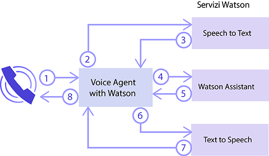
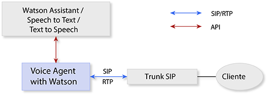
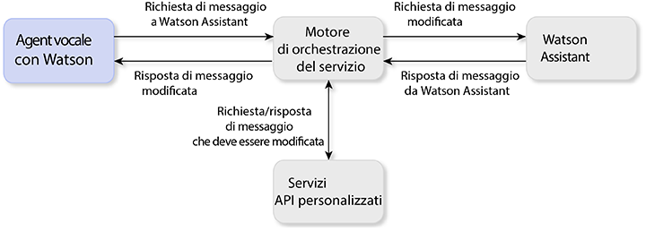

---

copyright:
  years: 2017, 2018
lastupdated: "2018-06-13"

---

{:shortdesc: .shortdesc}
{: new_window: target="_blank"}
{:codeblock: .codeblock}
{:pre: .pre}
{:screen: .screen}
{:tip: .tip}

# Informazioni su Voice Agent with Watson
{: #about}

{{site.data.keyword.iva_full}} abilita le interazioni vocali automatizzate e dirette tramite il telefono tra un agent vocale cognitivo e i tuoi clienti. Con l'intelligenza artificiale Watson nella sua backbone, il tuo agent vocale può comunicare in modo più colloquiale e può gestire iterazioni complesse che sono difficili per i sistemi IVR (interactive voice response) tradizionali.
{: shortdesc}

## Architettura
{: #architecture}

{{site.data.keyword.iva_short}} è uno dei vari componenti nell'architettura generale del tuo ambiente, che può includere i seguenti elementi:

* Un agent vocale basato su [IBM Voice Gateway ](https://www.ibm.com/support/knowledgecenter/SS4U29/), che orchestra i seguenti servizi Watson:
  * [{{site.data.keyword.speechtotextshort}} ](https://console.bluemix.net/docs/services/speech-to-text/index.html): converte l'audio del chiamante in testo
  * [{{site.data.keyword.conversationshort}} ](https://console.bluemix.net/docs/services/conversation/index.html) o [{{site.data.keyword.virtualagentshort}} ](https://console.bluemix.net/docs/services/virtual-agent/getting-started.html#getting-started): analizza il testo, lo associa agli intenti e risponde in base a un dialogo che crei
  * [{{site.data.keyword.texttospeechshort}} ](https://console.bluemix.net/docs/services/text-to-speech/index.html): converte le risposte in un audio vocale
* Un trunk SIP, che collega il tuo agent vocale alla rete del telefono
* Un motore di orchestrazione del servizio (SOE) facoltativo, che si pone tra il servizio {{site.data.keyword.conversationshort}} e il tuo agent vocale in modo che puoi ulteriormente personalizzare il tuo ambiente

### Orchestrazione del servizio Watson
{: #watson}

Il seguente diagramma illustra come {{site.data.keyword.iva_short}} orchestra i vari servizi Watson per creare un agent vocale. In pochi secondi, il flusso di espressioni tra i servizi produrrà una conversazione di linguaggio naturale con il chiamante.

La seguente procedura descrive il flusso di conversazione.

1. Il chiamante pone una domanda.
1. La domanda viene trasmessa al servizio {{site.data.keyword.speechtotextshort}}.
1. Viene restituita un'espressione di testo.
1. Il testo viene inviato al servizio {{site.data.keyword.conversationshort}} o a {{site.data.keyword.virtualagentshort}} come una richiesta di messaggio.
1. Viene restituita una risposta di messaggio.
1. Il testo di risposta viene inviato al servizio {{site.data.keyword.texttospeechshort}}.
1. Viene restituito l'audio sintetizzato.
1. {{site.data.keyword.iva_short}} trasmette la risposta audio al chiamante.

### Architettura con un trunk SIP
{: #arch-sip}

Puoi utilizzare i trunk SIP per configurare e verificare velocemente il tuo ambiente dalla rete telefonica pubblica. Quando colleghi un agent vocale tramite un trunk SIP, devi configurare il tuo trunk SIP per inoltrare le richieste INVITE all'agent vocale in base al proprio indirizzo IP. Puoi trovare il tuo indirizzo IP del server {{site.data.keyword.iva_short}} nella pagina _Getting started_.

### Architettura con un motore di orchestrazione del servizio
{: #arch-soe}

Quando configuri il servizio {{site.data.keyword.conversationshort}}, puoi includere un motore di orchestrazione del servizio (SOE) per personalizzare la comunicazione tra {{site.data.keyword.iva_short}} e il servizio. Il motore di orchestrazione del servizio funge da proxy per il servizio {{site.data.keyword.conversationshort}}, intercettando le richieste e le risposte di messaggio e modificandole utilizzando API di terze parti. {{site.data.keyword.iva_short}} e il servizio {{site.data.keyword.conversationshort}} comunicano tramite l'API REST del servizio {{site.data.keyword.conversationshort}}, inviando i dati della richiesta utilizzando il metodo `MessageRequest` e ricevendo una risposta JSON corrispondente. Puoi anche utilizzare un SOE come proxy per {{site.data.keyword.virtualagentshort}}, che agisce nello stesso modo.

Potresti voler incorporare un motore di orchestrazione del servizio nella tua distribuzione {{site.data.keyword.iva_full_notm}} per i seguenti motivi:

* Per annullare l'identità delle richieste e rimuovere le informazioni personali come PHI, PII e PCI prima che vengano inviate al servizio {{site.data.keyword.conversationshort}} 
* Per personalizzare le risposte dal servizio {{site.data.keyword.conversationshort}}, ad esempio utilizzando le informazioni di ubicazione del cliente per fornire una previsione meteo personale
* Per abilitare le funzioni di telefonia, come l'inclusione di un ID del chiamante o la raccolta delle cifre DTMF dei numeri dell'account
* Per personalizzare le interazioni con i clienti utilizzando le API
* Per integrare la sicurezza vocale utilizzando DTMF o la biometrica

Per ulteriori informazioni su come implementare un motore di orchestrazione del servizio, vedi [service orchestration engine samples on GitHub ](https://github.com/WASdev/sample.voice.gateway/tree/master/soe){: new_window}. Ti consigliamo di proteggere il tuo motore di orchestrazione del servizio con un nome utente e una password.

## Funzioni
{: #features}

* **Interruzione:** i chiamanti possono interrompere Watson se l'espressione Watson che sta venendo inviata al chiamante non è rilevante nel contesto della conversazione.
* **Riaggancio della chiamata:** all'agent vocale può essere segnalato di terminare la chiamata dal servizio {{site.data.keyword.conversationshort}} impostando una tag di azione.
* **Musica in attesa:** l'agent vocale può riprodurre un file audio specificato da {{site.data.keyword.conversationshort}} per un periodo di tempo o finché l'elaborazione in {{site.data.keyword.conversationshort}} non è completa. 
* **Inserimento di tag SSML:** le tag Speech Synthesis Markup Language (SSML) vengono utilizzate per controllare come {{site.data.keyword.texttospeechshort}} sintetizza le espressioni in audio. {{site.data.keyword.iva_short}} supporta il passaggio di queste tag tramite {{site.data.keyword.texttospeechshort}} quando ricevute dal servizio {{site.data.keyword.conversationshort}}.
* **Supporto DTMF:** {{site.data.keyword.iva_short}} supporta [RFC 4733 ](https://tools.ietf.org/html/rfc4733), il payload RTP per le cifre DTMF, i toni e le trasmissioni di telefonia. Le trasmissioni Dual-tone multi-frequency (DTMF) vengono convertite in espressioni di testo a singola cifra che vengono inviate ai servizi Watson.

## Lingue supportate
{: #supported-languages}

Perché una lingua venga supportata, lo deve essere da tutti i servizi Watson che configuri nel tuo agent vocale. Utilizzando i servizi {{site.data.keyword.speechtotextshort}} e {{site.data.keyword.texttospeechshort}} e {{site.data.keyword.conversationshort}} o {{site.data.keyword.virtualagentshort}}, sono supportate le seguenti lingue:

* Portoghese brasiliano
* Giapponese
* Spagnolo
* Inglese (Regno Unito)
* Inglese (US)

## Protocolli supportati
{: #supported-protocols}

* **SIP:** l'agent vocale supporta la connessione a Watson come se fosse presente un endpoint SIP tramite un trunk SIP, da un SBC (session border controller) aziendale o da un MCU (multipoint control unit).
* **RTP:** Real-time Transport Protocol (RTP) è supportato per i flussi del supporto audio.
* **G.711:** l'agent vocale supporta audio G.711 U-law e A-law. Gli altri protocolli audio, come G.723 o G.729, non sono al momento supportati.
