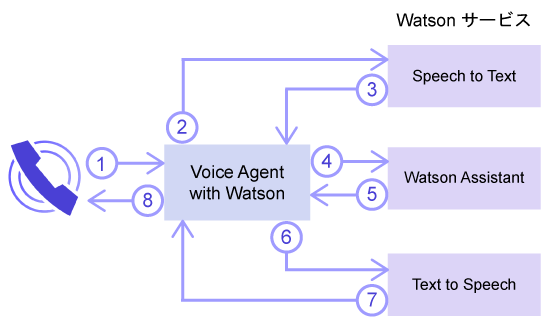
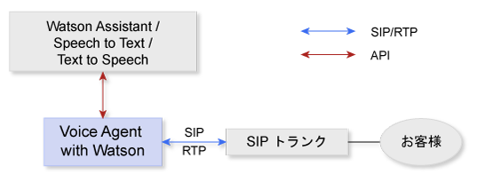
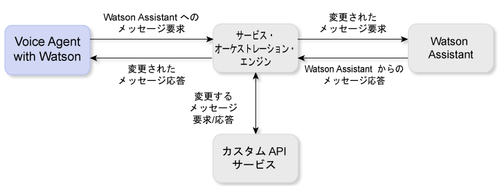

---

copyright:
  years: 2017, 2018
lastupdated: "2018-06-13"

---

{:shortdesc: .shortdesc}
{: new_window: target="_blank"}
{:codeblock: .codeblock}
{:pre: .pre}
{:screen: .screen}
{:tip: .tip}

# Voice Agent with Watson について
{: #about}

{{site.data.keyword.iva_full}} は、コグニティブ・ボイス・エージェントと顧客との間での、電話による直接的で自動化された音声対話を可能にします。 Watson の人工知能をバックボーンとするボイス・エージェントは、より会話的な方法で通信することができ、従来型の音声自動応答 (IVR) システムでは困難であった複雑な対話を処理することができます。
{: shortdesc}

## アーキテクチャー
{: #architecture}

{{site.data.keyword.iva_short}} は、環境の全体的なアーキテクチャー内にある複数のコンポーネントの 1 つで、以下の要素が含まれることがあります。

* [IBM Voice Gateway ](https://www.ibm.com/support/knowledgecenter/SS4U29/) に基づくボイス・エージェント。これは以下の複数の Watson サービスを調整します。
  * [{{site.data.keyword.speechtotextshort}} ](https://console.bluemix.net/docs/services/speech-to-text/index.html): 発信者の音声をテキストに変換します
  * [{{site.data.keyword.conversationshort}} ](https://console.bluemix.net/docs/services/conversation/index.html) または [{{site.data.keyword.virtualagentshort}} ](https://console.bluemix.net/docs/services/virtual-agent/getting-started.html#getting-started): テキストを分析し、それをインテントにマップして、ユーザーが作成したダイアログに基づいて応答を提供します。
  * [{{site.data.keyword.texttospeechshort}} ](https://console.bluemix.net/docs/services/text-to-speech/index.html): 応答を音声オーディオに変換します。
* SIP トランク。これはボイス・エージェントを電話網に接続します
* オプションのサービス・オーケストレーション・エンジン (SOE)。これは {{site.data.keyword.conversationshort}} サービスとボイス・エージェントの間に存在して、環境をさらにカスタマイズできるようにします

### Watson サービス・オーケストレーション
{: #watson}

以下の図は、{{site.data.keyword.iva_short}} がどのようにさまざまな Watson サービスを調整してボイス・エージェントを形作るのかを示しています。 発話は数秒の間に複数のサービス間をフローし、発信者との自然な会話が形成されます。

会話フローは以下のようなステップで行われます。

1. 発信者が質問をします。
1. 質問は {{site.data.keyword.speechtotextshort}} サービスに流されます。
1. テキストの発話が返されます。
1. テキストが {{site.data.keyword.conversationshort}} サービスまたは {{site.data.keyword.virtualagentshort}} にメッセージ要求として送信されます。
1. メッセージ応答が返されます。
1. 応答テキストが {{site.data.keyword.texttospeechshort}} サービスに送信されます。
1. 合成音声が返されます。
1. {{site.data.keyword.iva_short}} が発信者に対して音声応答を流します。

### SIP トランクを使用するアーキテクチャー
{: #arch-sip}

SIP トランクを使用して、公衆電話網から環境を素早くセットアップし、テストすることができます。 SIP トランクを介してボイス・エージェントに接続するときは、INVITE 要求をボイス・エージェントに、その IP アドレスに基づいて転送するように SIP トランクを構成する必要があります。 {{site.data.keyword.iva_short}} サーバーの IP アドレスは、_「開始 (Getting started)」_ページに記載されています。

### サービス・オーケストレーション・エンジンを使用するアーキテクチャー
{: #arch-soe}

{{site.data.keyword.conversationshort}} サービスの構成時にサービス・オーケストレーション・エンジン (SOE) を組み込んで、{{site.data.keyword.iva_short}} とサービスの間の通信をカスタマイズすることができます。 メッセージ要求と応答を代行受信し、それらをサード・パーティー API を使用して変更することで、サービス・オーケストレーション・エンジンは {{site.data.keyword.conversationshort}} サービスのプロキシーとして機能します。 {{site.data.keyword.iva_short}} と {{site.data.keyword.conversationshort}} サービスは、{{site.data.keyword.conversationshort}} サービスの REST API を介して通信し、`MessageRequest` 方式を使用して要求データを送信し、対応する JSON 応答を受信します。 SOE を {{site.data.keyword.virtualagentshort}} のプロキシーとして使用することもできます。その場合は SOE によって同様の機能が実行されます。

サービス・オーケストレーション・エンジンは次のような目的で {{site.data.keyword.iva_full_notm}} デプロイメントに取り込むことができます。

* 要求を匿名化して、PHI、PII、PCI などの個人情報を {{site.data.keyword.conversationshort}} サービスに送信する前に除去するため
* {{site.data.keyword.conversationshort}} サービスからの応答をパーソナライズするため (例えば、顧客の位置情報を使用して個人別の天気予報を提供するなど)
* 電話機能 (例えば、発信者 ID の組み込みやアカウント番号の DTMF ディジットの収集など) を使用できるようにするため
* API を使用して顧客とのやり取りをカスタマイズするため
* DTMF や生体認証を使用して音声セキュリティーを組み込むため

サービス・オーケストレーション・エンジンを実装する方法について詳しくは、[GitHub のサービス・オーケストレーション・エンジンのサンプル ](https://github.com/WASdev/sample.voice.gateway/tree/master/soe){: new_window} を参照してください。

**重要**: データ・セキュリティーの場合、`http:` ではなく `https:` を使用して、SOE ワークスペースにセキュア URL を使用していることを確認してください。また、認証が必要です。 セキュリティーに関する考慮事項の詳細については、[機密保護とデータ・プライバシー](infosec.html)を参照してください。

## 機能
{: #features}

* **バージイン:** Watson が発信者に送る発話が会話のコンテキストに関連していない場合に、発信者が Watson を中断することができます。
* **通話のハングアップ:** アクション・タグを設定することにより、通話を終了するように {{site.data.keyword.conversationshort}} サービスからボイス・エージェントに合図することができます。
* **保留中の音楽:** ボイス・エージェントは、一定の期間または {{site.data.keyword.conversationshort}} での処理が完了するまでの間、{{site.data.keyword.conversationshort}} によって指定された音声ファイルを再生できます。
* **SSML タグ付け:** Speech Synthesis Markup Language (SSML) タグを使用して、{{site.data.keyword.texttospeechshort}} が発話から音声を合成する方法を制御できます。 {{site.data.keyword.iva_short}} では、{{site.data.keyword.conversationshort}} サービスから受け取ったこれらのタグの {{site.data.keyword.texttospeechshort}} への引き渡しがサポートされています。
* **DTMF サポート:** {{site.data.keyword.iva_short}} は [RFC 4733 ](https://tools.ietf.org/html/rfc4733)、RTP Payload for DTMF Digits、Telephony Tones、および Telephony Signals をサポートしています。 デュアル・トーン多重周波数 (DTMF) 信号は、Watson サービスに送信される 1 桁のテキスト発話に変換されます。

## サポートされる言語
{: #supported-languages}

ある言語がサポートされるためには、ボイス・エージェントで構成するすべての Watson サービスでその言語がサポートされている必要があります。 {{site.data.keyword.speechtotextshort}} と {{site.data.keyword.texttospeechshort}} サービス、および {{site.data.keyword.conversationshort}} または {{site.data.keyword.virtualagentshort}} のいずれかを使用する場合は、以下の言語がサポートされます。

* ブラジル・ポルトガル語
* 日本語
* スペイン語
* 英国英語
* 米国英語

## サポートされるプロトコル
{: #supported-protocols}

* **SIP:** ボイス・エージェントは、SIP トランクを介して SIP エンドポイントからであるかのように、エンタープライズ・セッション・ボーダー・コントローラー (SBC) またはマルチポイント・コントロール・ユニット (MCU) から Watson に接続する処理をサポートします。
* **RTP:** オーディオ・メディア・ストリームのために Real-time Transport Protocol (RTP) がサポートされています。
* **G.711:** ボイス・エージェントは、U-law および A-law G.711 オーディオのみをサポートします。 G.723 や G.729 などの他のオーディオ・プロトコルは現時点ではサポートされていません。
