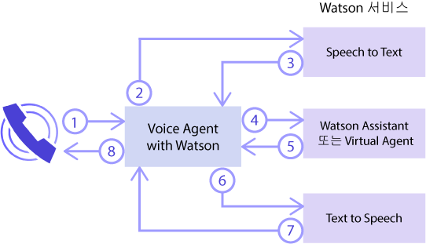
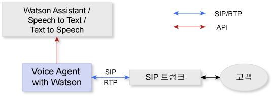
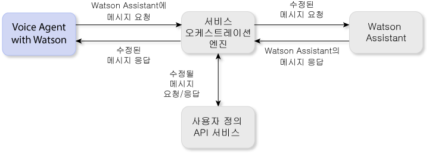
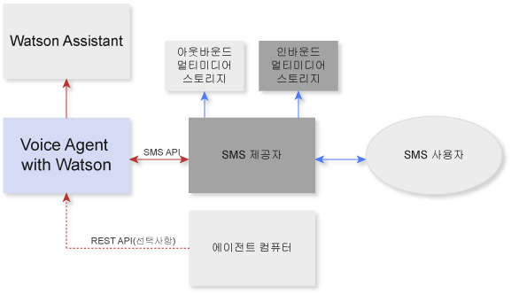

---

copyright:
  years: 2017, 2018
lastupdated: "2018-11-06"
subcollection: "voice-agent"

---

{:shortdesc: .shortdesc}
{: new_window: target="_blank"}
{:codeblock: .codeblock}
{:pre: .pre}
{:screen: .screen}
{:tip: .tip}

# Voice Agent with Watson 정보
{: #about}

{{site.data.keyword.iva_full}}은 전화 통신을 통해 코그너티브 음성 에이전트와 고객 간의 자동화된 직접 음성 상호작용을 가능하게 합니다. 백본에 Watson 인공지능을 사용하면 음성 에이전트가 더 자연스러운 대화 방식으로 통신할 수 있으며 기존의 대화식 음성 응답(IVR) 시스템에서는 처리하기 어려운 복잡한 상호작용을 처리할 수 있습니다.
{: shortdesc}

## 아키텍처
{: #architecture}

{{site.data.keyword.iva_short}}은 전체 사용자 환경 아키텍처의 여러 컴포넌트 중 하나이며 다음 요소를 포함할 수 있습니다.

* 다음과 같은 Watson 서비스를 조정하는 [IBM Voice Gateway ](https://www.ibm.com/support/knowledgecenter/SS4U29/) 기반의 음성 에이전트
  * [{{site.data.keyword.speechtotextshort}} ](/docs/services/speech-to-text?topic=speech-to-text-about): 호출자의 오디오를 텍스트로 변환
  * [{{site.data.keyword.conversationshort}} ](/docs/services/assistant?topic=assistant-index#index): 텍스트를 분석하여 인텐트에 맵핑하고 작성한 대화에 따라 응답 제공
  * [{{site.data.keyword.texttospeechshort}} ](/docs/services/text-to-speech?topic=text-to-speech-about): 응답을 음성 오디오로 변환
* 음성 에이전트를 전화 네트워크에 연결하는 SIP 트렁크
* 사용자 환경을 세부적으로 사용자 정의할 수 있도록 {{site.data.keyword.conversationshort}} 서비스와 음성 에이전트 사이에 위치하는 선택적 서비스 오케스트레이션 엔진(SOE)

### Watson 서비스 오케스트레이션
{: #watson}

다음 다이어그램은 {{site.data.keyword.iva_short}}이 음성 에이전트를 작성하기 위해 다양한 Watson 서비스를 조정하는 방법을 보여줍니다. 몇 초 이내에 서비스 간의 발화 플로우가 진행되어 호출자와의 자연스러운 대화가 이루어집니다.

다음 단계에는 대화 플로우가 요약되어 있습니다.

1. 호출자가 질문합니다.
1. 질문이 {{site.data.keyword.speechtotextshort}} 서비스로 스트리밍됩니다.
1. 텍스트 발화가 리턴됩니다.
1. 텍스트가 {{site.data.keyword.conversationshort}} 서비스에 메시지 요청으로 전송됩니다.
1. 메시지 응답이 리턴됩니다.
1. 응답 텍스트가 {{site.data.keyword.texttospeechshort}} 서비스에 전송됩니다.
1. 합성된 오디오가 리턴됩니다.
1. {{site.data.keyword.iva_short}}이 발신자에게 오디오 응답을 스트리밍합니다.

### SIP 트렁크가 포함된 아키텍처
{: #arch-sip}

SIP 트렁크를 사용하여 공중 전화망(PTN)에서 사용자 환경을 빠르게 설정하고 테스트할 수 있습니다. SIP 트렁크를 통해 음성 에이전트에 연결하는 경우 IP 주소를 기반으로 음성 에이전트에 INVITE 요청을 전달하도록 SIP 트렁크를 구성해야 합니다. _시작하기_ 페이지에서 {{site.data.keyword.iva_short}} SIP URI 엔드포인트를 찾을 수 있습니다.

### 서비스 오케스트레이션 엔진이 포함된 아키텍처
{: #arch-soe}

{{site.data.keyword.conversationshort}} 서비스를 구성할 때 {{site.data.keyword.iva_short}}과 서비스 간 통신을 사용자 정의하기 위한 서비스 오케스트레이션 엔진(SOE)을 포함할 수 있습니다. 서비스 오케스트레이션 엔진은 메시지 응답 및 요청을 인터셉트하고 서드파티 API로 수정하여 {{site.data.keyword.conversationshort}} 서비스에 대한 프록시 역할을 수행할 수 있습니다. {{site.data.keyword.iva_short}} 및 {{site.data.keyword.conversationshort}} 서비스는 `MessageRequest` 메소드를 사용하여 요청 데이터를 전송하고 해당 JSON 응답을 수신하여 {{site.data.keyword.conversationshort}} 서비스의 REST API를 통해 통신합니다.

다음과 같은 이유로 {{site.data.keyword.iva_full_notm}} 배치에서 서비스 오케스트레이션 엔진을 통합할 수 있습니다.

* 요청 비식별화 및 {{site.data.keyword.conversationshort}} 서비스에 전송되기 전에 PHI, PII 및 PCI와 같은 개인 정보 제거
* {{site.data.keyword.conversationshort}} 서비스의 응답 개인화(예: 고객 위치 정보를 사용하여 개인 일기 예보 제공)
* 발신자 ID 포함 또는 계정 번호에 대한 DTMF 숫자 수집과 같은 전화 통신 기능 사용
* API를 사용하여 고객과의 상호작용 사용자 정의
* DTMF 또는 생채인식을 사용하여 음성 보안 통합

서비스 오케스트레이션 엔진을 구현하는 방법에 대해 자세히 알아보려면 [GitHub의 서비스 오케스트레이션 엔진 샘플 ](https://github.com/WASdev/sample.voice.gateway/tree/master/soe){: new_window}을 참조하십시오.

**중요**: 데이터 보안을 위해 `http:` 대신 `https:`를 사용하여 SOE 작업공간에 보안 URL을 사용해야 하고 인증을 요구해야 합니다. 보안 고려사항에 대해 자세히 보려면 [정보 보안 및 데이터 개인정보 보호](/docs/services/voice-agent?topic=voice-agent-infosec)를 참조하십시오.

### 디지털 메시지가 포함된 아키텍처
{: #arch-sms}

SMS와 MMS 메시지를 교환하여 고객이 상호 작용할 수 있는 코그너티브 SMS 에이전트를 설정할 수 있습니다. IBM {{site.data.keyword.conversationshort}} 서비스에서 대화 상자를 사용하면 SMS 에이전트가 태스크, 질문에 대한 답변 등을 통해 고객을 안내할 수 있습니다. SMS 에이전트에 연결할 경우, 메시지를 전달할 SMS 제공자에게 전달하는 SMS 요청 URL 또는 웹훅을 SMS 제공자에서 구성해야 합니다. _시작하기_ 페이지에서 {{site.data.keyword.iva_short}} SMS URI 엔드포인트를 찾을 수 있습니다.

## 기능
{: #features}

* **끼어들기:** Watson에서 호출자에게 전송 중인 발화가 대화의 컨텍스트와 관련이 없는 경우 호출자가 인터럽트할 수 있습니다.
* **통화 끊기:** 조치 태그를 설정하여 {{site.data.keyword.conversationshort}} 서비스로부터의 통화를 종료하도록 음성 에이전트에 신호를 보낼 수 있습니다.
* **대기 중 음악:** 음성 에이전트가 일정 기간 동안 또는 {{site.data.keyword.conversationshort}}의 처리가 완료될 때까지 {{site.data.keyword.conversationshort}}에서 지정된 오디오 파일을 재생할 수 있습니다.
* **SSML 태그 지정:** SSML(Speech Synthesis Markup Language) 태그를 사용하여 {{site.data.keyword.texttospeechshort}}에서 발화를 오디오로 합성하는 방법을 제어합니다. {{site.data.keyword.iva_short}}은 {{site.data.keyword.conversationshort}} 서비스에서 수신될 때 이러한 태그를 {{site.data.keyword.texttospeechshort}}에 전달하도록 지원합니다.
* **DTMF 지원:** {{site.data.keyword.iva_short}}은 [RFC 4733 ](https://tools.ietf.org/html/rfc4733), DTMF 숫자를 위한 RTP 페이로드, 전화 신호음 및 전화 신호를 지원합니다. DTMF(Dual-Tone Multi-Frequency) 신호가 Watson 서비스에 전송되는 단일 숫자 발화로 변환됩니다.

## 지원되는 언어
{: #supported-languages}

언어가 지원되려면 음성 에이전트에서 구성하는 모든 Watson 서비스에서 지원되어야 합니다. {{site.data.keyword.speechtotextshort}}, {{site.data.keyword.texttospeechshort}} 및 {{site.data.keyword.conversationshort}} 서비스를 사용하는 경우 다음 언어가 지원됩니다.

* 브라질 포르투갈어
* 프랑스어({{site.data.keyword.speechtotextshort}} 광대역 전용)
* 독일어({{site.data.keyword.speechtotextshort}} 광대역 전용)
* 일본어
* 스페인어
* 영어(영국)
* 영어(미국)

## 지원되는 프로토콜
{: #supported-protocols}

* **SIP:** 음성 에이전트는 엔터프라이즈 SBC(Session Border Controller) 또는 다중 접속 제어 장치(MCU)에서 SIP 트렁크를 통해 SIP 엔드포인트인 것처럼 Watson에 연결하도록 지원합니다.
* **RTP:** 오디오 미디어 스트림에 대해 RTP(Real-time Transport Protocol)가 지원됩니다.
* **G.711:** 음성 에이전트는 U-law 및 A-law G.711 오디오를 지원합니다. G.723 또는 G.729와 같은 다른 오디오 프로토콜은 현재 지원되지 않습니다.
