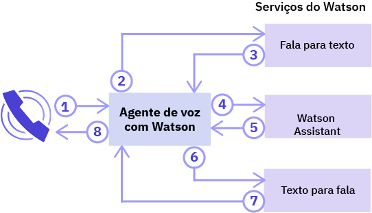
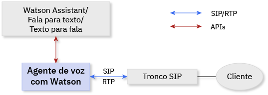
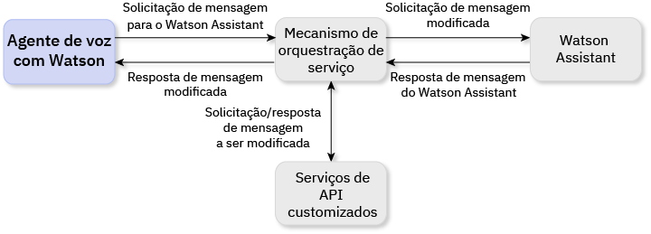

---

copyright:
  years: 2017, 2018
lastupdated: "2018-11-06"

---

{:shortdesc: .shortdesc}
{: new_window: target="_blank"}
{:codeblock: .codeblock}
{:pre: .pre}
{:screen: .screen}
{:tip: .tip}

# Sobre o agente de voz com o Watson
{: #about}

O {{site.data.keyword.iva_full}} permite interações de voz por telefone, diretas e automatizadas, entre um agente cognitivo de voz e seus clientes. Com a inteligência artificial do Watson em seu backbone, seu agente de voz pode se comunicar de uma maneira de mais conversação e pode manipular interações complexas que são difíceis para sistemas tradicionais de resposta de voz interativa (IVR).
{: shortdesc}

## Arquitetura
{: #architecture}

O {{site.data.keyword.iva_short}} é um dos vários componentes na arquitetura geral de seu ambiente, que pode incluir os seguintes elementos:

* Um agente de voz com base no [IBM Voice Gateway ](https://www.ibm.com/support/knowledgecenter/SS4U29/), que orquestra os seguintes serviços do Watson:
  * [{{site.data.keyword.speechtotextshort}} ](../speech-to-text/index.html): converte o áudio do responsável pela chamada em texto
  * [{{site.data.keyword.conversationshort}} ](../conversation/index.html): analisa o texto, mapeia-o para os intentos e fornece uma resposta de acordo com um diálogo que você cria
  * [{{site.data.keyword.texttospeechshort}} ](../text-to-speech/index.html): converte a resposta em áudio de voz
* Um tronco SIP, que conecta seu agente de voz à rede telefônica
* Um mecanismo de orquestração de serviço (SOE) opcional, que fica entre o serviço {{site.data.keyword.conversationshort}} e seu agente de voz para que seja possível customizar ainda mais o seu ambiente

### Orquestração de serviços do Watson
{: #watson}

O diagrama a seguir mostra como o {{site.data.keyword.iva_short}} orquestra os vários serviços do Watson para criar um agente de voz. Em segundos, as elocuções fluem entre os serviços para resultar em uma conversa que soe natural com o responsável pela chamada.

As etapas a seguir descrevem o fluxo da conversa.

1. O responsável pela chamada faz uma pergunta.
1. A pergunta é transmitida para o serviço {{site.data.keyword.speechtotextshort}}.
1. Uma elocução de texto é retornada.
1. O texto é enviado para o serviço {{site.data.keyword.conversationshort}} como uma solicitação de mensagem.
1. Uma mensagem de resposta é retornada.
1. O texto da resposta é enviado para o serviço {{site.data.keyword.texttospeechshort}}.
1. Um áudio sintetizado é retornado.
1. O {{site.data.keyword.iva_short}} transmite a resposta de áudio para o responsável pela chamada.

### Arquitetura com um tronco SIP
{: #arch-sip}

É possível usar troncos SIP para rapidamente configurar e testar seu ambiente da rede telefônica pública. Ao se conectar a um agente de voz por meio de um tronco SIP, é necessário configurar o tronco SIP para redirecionar as solicitações INVITE para o agente de voz com base em seu endereço IP. É possível localizar seu endereço IP do servidor {{site.data.keyword.iva_short}} na página _Introdução_.

### Arquitetura com um mecanismo de orquestração de serviço
{: #arch-soe}

Ao configurar o serviço {{site.data.keyword.conversationshort}}, é possível incluir um mecanismo de
orquestração de serviço (SOE) para customizar a comunicação entre o {{site.data.keyword.iva_short}} e o serviço. O mecanismo
de orquestração de serviço age como um proxy para o serviço {{site.data.keyword.conversationshort}}, interceptando as solicitações e as respostas de mensagens e modificando-as usando APIs de terceiro. {{site.data.keyword.iva_short}} e o serviço {{site.data.keyword.conversationshort}} se comunicam por meio da API REST do serviço {{site.data.keyword.conversationshort}}, enviando dados de solicitação usando o método `MessageRequest` e recebendo uma resposta JSON correspondente.

Talvez você queira incorporar um mecanismo de orquestração de serviço em sua implementação do {{site.data.keyword.iva_full_notm}} pelas razões a seguir:

* Para remover a identificação de solicitações e remover informações pessoais, como PHI, PII e PCI, antes que sejam enviadas
para o serviço {{site.data.keyword.conversationshort}}
* Para personalizar respostas do serviço {{site.data.keyword.conversationshort}}, por exemplo usando informações de localização do cliente para fornecer uma previsão do tempo pessoal
* Para ativar recursos de telefonia, como incluir o ID do responsável pela chamada ou coletar dígitos DTMF para números de contas
* Para customizar interações com clientes usando APIs
* Para integrar a segurança de voz usando DTMF ou biometria

Para saber mais sobre como implementar um mecanismo de orquestração de serviço, consulte as [amostras do mecanismo de orquestração de serviço em GitHub ](https://github.com/WASdev/sample.voice.gateway/tree/master/soe){: new_window}.

**Importante**: para segurança de dados, assegure-se de usar uma URL segura para sua área de trabalho SOE usando `https:` em vez de `http:` e de requerer autenticação. Consulte [Segurança de informações e privacidade de dados](infosec.html) para saber mais sobre considerações de segurança.

## Recursos
{: #features}

* **Interrupção:** os responsáveis pela chamada poderão interromper o Watson se a elocução que o Watson estiver enviando ao responsável pela chamada não for relevante para o contexto da conversa.
* **Desligamento da chamada:** o agente de voz pode ser avisado para que termine uma chamada do serviço {{site.data.keyword.conversationshort}} configurando uma tag de ação.
* **Música em espera:** o agente de voz pode reproduzir um arquivo de áudio que é especificado pelo
{{site.data.keyword.conversationshort}} por um período ou até que o processamento no
{{site.data.keyword.conversationshort}} seja concluído.
* **Identificação SSML:** as tags Speech Synthesis Markup Language (SSML) são usadas para controlar como o {{site.data.keyword.texttospeechshort}} sintetiza as elocuções no áudio. O {{site.data.keyword.iva_short}} suporta passar essas tags para o {{site.data.keyword.texttospeechshort}} quando recebidas do serviço {{site.data.keyword.conversationshort}}.
* **Suporte DTMF:** o {{site.data.keyword.iva_short}} suporta [RFC 4733 ](https://tools.ietf.org/html/rfc4733), Carga útil RTP para dígitos DTMF, Tons de telefonia e Sinais de telefonia. Os sinais de multifrequência com sinal duplo (DTMF) são convertidos em elocuções de texto de dígito único que são enviadas para os serviços do Watson.

## Idiomas Suportados
{: #supported-languages}

Para que um idioma seja suportado, ele deve ser suportado por todos os serviços do Watson que você configura em seu agente de voz. Usando os serviços {{site.data.keyword.speechtotextshort}}, {{site.data.keyword.texttospeechshort}} e {{site.data.keyword.conversationshort}}, os seguintes idiomas são suportados:

* Português do Brasil
* Francês ({{site.data.keyword.speechtotextshort}} banda larga apenas)
* Alemão ({{site.data.keyword.speechtotextshort}} banda larga apenas)
* Japonês
* Espanhol
* Inglês do Reino Unido
* Inglês dos EUA

## Protocolos Suportados
{: #supported-protocols}

* **SIP:** o agente de voz suporta a conexão com o Watson como se fosse um terminal SIP por meio de um tronco SIP, de um controlador de borda de sessão corporativa (SBC) ou de uma unidade de controle de multiponto (MCU).
* **RTP:** o Protocolo de Transporte em Tempo Real (RTP) é suportado para fluxos de mídia de áudio.
* **G.711:** o agente de voz suporta áudio U-law e A-law G.711. Outros protocolos de áudio, como G.723 ou G.729, não são suportados atualmente.
