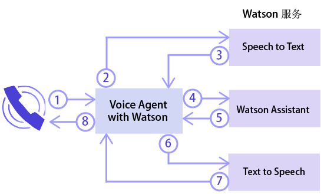
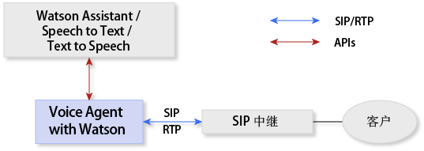
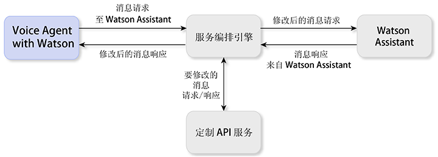

---

copyright:
  years: 2017, 2018
lastupdated: "2018-06-13"

---

{:shortdesc: .shortdesc}
{: new_window: target="_blank"}
{:codeblock: .codeblock}
{:pre: .pre}
{:screen: .screen}
{:tip: .tip}

# 关于 Voice Agent with Watson
{: #about}

{{site.data.keyword.iva_full}} 支持在认知语音代理程序与您的客户之间通过电话直接进行自动语音交互。该服务的主干采用了 Watson 人工智能，让您的语音代理程序可以更自然地进行对话交流，还可以处理传统交互式语音响应 (IVR) 系统难以处理的复杂交互。
{: shortdesc}

## 体系结构
{: #architecture}

{{site.data.keyword.iva_short}} 是您环境的总体体系结构中的一个组件，其可包含以下元素：

* 基于 [IBM Voice Gateway ](https://www.ibm.com/support/knowledgecenter/SS4U29/) 的语音代理程序，用于编排以下 Watson 服务：
  * [{{site.data.keyword.speechtotextshort}} ](https://console.bluemix.net/docs/services/speech-to-text/index.html)：将呼叫者的音频转换为文本
  * [{{site.data.keyword.conversationshort}} ](https://console.bluemix.net/docs/services/conversation/index.html) 或 [{{site.data.keyword.virtualagentshort}} ](https://console.bluemix.net/docs/services/virtual-agent/getting-started.html#getting-started)：分析文本，将其映射到意向，然后根据您创建的对话提供响应
  * [{{site.data.keyword.texttospeechshort}} ](https://console.bluemix.net/docs/services/text-to-speech/index.html)：将响应转换为语音音频
* SIP 中继，用于将语音代理程序连接到电话网络
* （可选）服务编排引擎 (SOE)，位于 {{site.data.keyword.conversationshort}} 服务与语音代理程序之间，您可以使用它来进一步定制自己的环境

### Watson 服务编排
{: #watson}

下图显示了 {{site.data.keyword.iva_short}} 如何编排各种 Watson 服务来创建一个语音代理程序。只需几秒钟时间，话语即可经由这些服务的处理，最终变成听起来很自然的与呼叫者的对话。

以下步骤概述对话流。

1. 呼叫者提出问题。
1. 问题被传送到 {{site.data.keyword.speechtotextshort}} 服务。
1. 返回文本话语。
1. 文本作为消息请求被发送到 {{site.data.keyword.conversationshort}} 服务或 {{site.data.keyword.virtualagentshort}}。
1. 返回消息响应。
1. 响应文本被发送到 {{site.data.keyword.texttospeechshort}} 服务。
1. 返回合成音频。
1. {{site.data.keyword.iva_short}} 将音频响应传送给呼叫者。

### 具有 SIP 中继的体系结构
{: #arch-sip}

可以使用 SIP 中继通过公用电话网络来快速设置和测试您的环境。通过 SIP 中继连接到语音代理程序时，必须将 SIP 中继配置为根据 IP 地址将 INVITE 请求转发给语音代理程序。您可以在_开始使用_页面上找到 {{site.data.keyword.iva_short}} 服务器 IP 地址。

### 具有服务编排引擎的体系结构
{: #arch-soe}

在配置 {{site.data.keyword.conversationshort}} 服务时，可以包含服务编排引擎 (SOE) 以定制 {{site.data.keyword.iva_short}} 与服务之间的通信。服务编排引擎通过拦截消息请求和响应，并使用第三方 API 对它们进行修改，充当 {{site.data.keyword.conversationshort}} 服务的代理。{{site.data.keyword.iva_short}} 通过 {{site.data.keyword.conversationshort}} 服务的 REST API 与 {{site.data.keyword.conversationshort}} 服务进行通信，它会使用 `MessageRequest` 方法发送请求数据和接收相应的 JSON 响应。您还可以将 SOE 用作 {{site.data.keyword.virtualagentshort}} 的代理，具体的运行方式与上述情况相同。

出于以下原因，您可能想要将服务编排引擎包含在您的 {{site.data.keyword.iva_full_notm}} 部署中：

* 要在请求传送到 {{site.data.keyword.conversationshort}} 服务之前对请求执行去识别化处理并除去个人信息，例如 PHI、PII 和 PCI
* 对来自 {{site.data.keyword.conversationshort}} 服务的响应进行个性化处理，例如使用客户位置信息来提供个性化天气预报
* 启用电话功能，例如包含呼叫者标识或针对帐号收集 DTMF 数字
* 使用 API 来定制与客户的交互
* 使用 DTMF 或生物识别技术来集成语音安全性

要了解有关如何实施服务编排引擎的更多信息，请参阅 [GitHub 上的服务编排引擎样本 ](https://github.com/WASdev/sample.voice.gateway/tree/master/soe){: new_window}。建议您使用用户名和密码来确保服务编排引擎的安全。

## 功能
{: #features}

* **打断**：如果 Watson 发送给呼叫者的话语与对话的上下文不相关，那么呼叫者可以中断 Watson。
* **呼叫挂断**：可以通过设置操作标记，指示语音代理程序结束来自 {{site.data.keyword.conversationshort}} 服务的呼叫。
* **等待音乐**：语音代理程序可以播放 {{site.data.keyword.conversationshort}} 所指定的音频文件一段时间，或者一直播放到 {{site.data.keyword.conversationshort}} 中的处理完成为止。
* **SSML 标记**：语音合成标记语言 (SSML) 标记用于控制 {{site.data.keyword.texttospeechshort}} 如何将话语合成为音频。{{site.data.keyword.iva_short}} 支持在从 {{site.data.keyword.conversationshort}} 服务收到这些标记后将它们传递到 {{site.data.keyword.texttospeechshort}}。
* **DTMF 支持**：{{site.data.keyword.iva_short}} 支持 [RFC 4733 ](https://tools.ietf.org/html/rfc4733) (RTP Payload for DTMF Digits, Telephony Tones, and Telephony Signals)。双音多频 (DTMF) 信号会在转换成单数位文本话语后传送到 Watson 服务。

## 支持的语言
{: #supported-languages}

只有您在语音代理程序中配置的所有 Watson 服务都支持的语言才受支持。使用 {{site.data.keyword.speechtotextshort}} 和 {{site.data.keyword.texttospeechshort}} 服务以及 {{site.data.keyword.conversationshort}} 或 {{site.data.keyword.virtualagentshort}} 时，支持以下语言：

* 巴西葡萄牙语
* 日语
* 西班牙语
* 英语（英国）
* 英语（美国）

## 支持的协议
{: #supported-protocols}

* **SIP**：语音代理程序支持通过企业会话边界控制器 (SBC) 或多点控制单元 (MCU) 连接到 Watson，就像通过 SIP 中继连接到 SIP 端点那样。
* **RTP**：音频媒体流支持实时传送协议 (RTP)。
* **G.711**：语音代理程序支持 U-law 和 A-law G.711 音频。目前不支持其他音频协议，例如 G.723 或 G.729。
