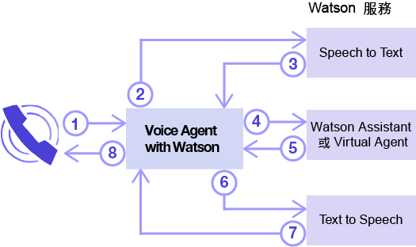
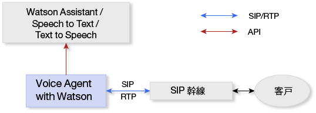
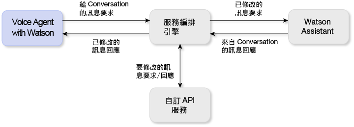

---

copyright:
  years: 2017, 2018
lastupdated: "2018-06-13"

---

{:shortdesc: .shortdesc}
{: new_window: target="_blank"}
{:codeblock: .codeblock}
{:pre: .pre}
{:screen: .screen}
{:tip: .tip}

# 關於 Voice Agent with Watson
{: #about}

{{site.data.keyword.iva_full}} 讓認知語音代理程式與您客戶之間能夠透過電話進行直接且自動化的語音互動。您的語音代理程式以 Watson 人工智慧為其骨幹，可以透過更交談式的方式進行通訊，並且可以處理傳統互動式語音回應 (IVR) 系統難以處理的複雜互動。
{: shortdesc}

## 架構
{: #architecture}

{{site.data.keyword.iva_short}} 是整體環境架構中數個元件之一，可包括下列元素：

* 以 [IBM Voice Gateway ](https://www.ibm.com/support/knowledgecenter/SS4U29/) 為基礎的語音代理程式，它可編排下列 Watson 服務：
  * [{{site.data.keyword.speechtotextshort}} ](https://console.bluemix.net/docs/services/speech-to-text/index.html)：將來電者的音訊轉換為文字
  * [{{site.data.keyword.conversationshort}} ](https://console.bluemix.net/docs/services/conversation/index.html) 或 [{{site.data.keyword.virtualagentshort}} ](https://console.bluemix.net/docs/services/virtual-agent/getting-started.html#getting-started)：分析文字、將它對映至目的，並根據您建立的對話提供回應
  * [{{site.data.keyword.texttospeechshort}} ](https://console.bluemix.net/docs/services/text-to-speech/index.html)：將回應轉換為語音音訊
* SIP 幹線，可將語音代理程式連接至電話網路
* 選用性的服務編排引擎 (SOE)，位於 {{site.data.keyword.conversationshort}} 服務與語音代理程式之間，可讓您進一步自訂環境

### Watson 服務編排
{: #watson}

下圖顯示 {{site.data.keyword.iva_short}} 如何編排各種 Watson 服務，以建立語音代理程式。在幾秒之內，話語會在服務之間流動，形成與來電者之間的原音交談。

下列步驟概述交談流程。

1. 來電者發問。
1. 問題會串流至 {{site.data.keyword.speechtotextshort}} 服務。
1. 傳回文字話語。
1. 文字會作為訊息要求傳送至 {{site.data.keyword.conversationshort}} 服務或 {{site.data.keyword.virtualagentshort}}。
1. 傳回訊息回應。
1. 回應文字會傳送至 {{site.data.keyword.texttospeechshort}} 服務。
1. 傳回合成音訊。
1. {{site.data.keyword.iva_short}} 會將音訊回應串流給來電者。

### 具有 SIP 幹線的架構
{: #arch-sip}

您可以使用 SIP 幹線，從公用電話網路快速設定及測試環境。當您透過 SIP 幹線連接至語音代理程式時，必須配置 SIP 幹線，根據其 IP 位址將 INVITE 要求轉遞至語音代理程式。您可以在_開始使用_ 頁面上找到 {{site.data.keyword.iva_short}} 伺服器 IP 位址。

### 具有服務編排引擎的架構
{: #arch-soe}

當您配置 {{site.data.keyword.conversationshort}} 服務時，可以包含服務編排引擎 (SOE)，以自訂 {{site.data.keyword.iva_short}} 與服務之間的通訊。服務編排引擎會充當 {{site.data.keyword.conversationshort}} 服務的 Proxy，方法為截取訊息要求及回應，並使用協力廠商 API 進行修改。{{site.data.keyword.iva_short}} 及 {{site.data.keyword.conversationshort}} 服務透過 {{site.data.keyword.conversationshort}} 服務的 REST API 進行通訊，並使用 `MessageRequest` 方法來傳送要求資料，以及接收對應的 JSON 回應。您也可以使用 SOE 作為 {{site.data.keyword.virtualagentshort}} 的 Proxy，其運作方式相同。

建議您將服務編排引擎納入 {{site.data.keyword.iva_full_notm}} 部署中，原因如下：

* 先取消識別要求並移除 PHI、PII 及 PCI 之類的個人資訊，然後再將它傳送至 {{site.data.keyword.conversationshort}} 服務
* 個人化來自 {{site.data.keyword.conversationshort}} 服務的回應，例如，藉由使用客戶位置資訊來提供個人氣象預測
* 啟用電話系統特性，例如包括來電顯示或收集帳戶號碼的 DTMF 數字
* 使用 API 自訂與客戶之間的互動
* 使用 DTMF 或生物識別技術整合語音安全

若要進一步瞭解如何實作服務編排引擎，請參閱 [GitHub 上的服務編排引擎範例 ](https://github.com/WASdev/sample.voice.gateway/tree/master/soe){: new_window}。建議您利用使用者名稱及密碼來保護服務編排引擎的安全。

## 特性
{: #features}

* **插話：**如果 Watson 傳送給來電者的話語和交談上下文無關，來電者可以岔斷 Watson。
* **掛斷通話：**藉由設定動作標籤，即可透過信號示意語音代理程式結束來自 {{site.data.keyword.conversationshort}} 服務的通話。
* **保留通話時的背景音樂：**語音代理程式可以播放 {{site.data.keyword.conversationshort}} 所指定的音訊檔一段時間，或播放直到 {{site.data.keyword.conversationshort}} 中的處理完成。
* **SSML 標記：**「語音合成標記語言 (SSML)」標籤用來控制 {{site.data.keyword.texttospeechshort}} 如何將話語合成為音訊。{{site.data.keyword.iva_short}} 支援在從 {{site.data.keyword.conversationshort}} 服務收到時，將這些標籤傳遞給 {{site.data.keyword.texttospeechshort}}。
* **DTMF 支援：**{{site.data.keyword.iva_short}} 支援 [RFC 4733 ](https://tools.ietf.org/html/rfc4733)、RTP Payload for DTMF Digits、Telephony Tones 及 Telephony Signals。雙音多頻 (DTMF) 信號會轉換為傳送至 Watson 服務的單一數位文字話語。

## 支援的語言
{: #supported-languages}

若要支援某個語言，您在語音代理程式中配置的所有 Watson 服務都必須支援它。使用 {{site.data.keyword.speechtotextshort}} 和 {{site.data.keyword.texttospeechshort}} 服務，以及 {{site.data.keyword.conversationshort}} 或 {{site.data.keyword.virtualagentshort}}，可支援下列語言：

* 巴西葡萄牙文
* 日文
* 西班牙文
* 英文（英國）
* 英文（美國）

## 支援的通訊協定
{: #supported-protocols}

* **SIP：**語音代理程式支援從企業階段作業邊界控制器 (SBC) 或多點控制裝置 (MCU) 連接至 Watson，就像它是透過 SIP 幹線的 SIP 端點一樣。
* **RTP：**針對音訊媒體串流，支援「即時傳輸通訊協定 (RTP)」。
* **G.711：**語音代理程式支援 U-law 及 A-law G.711 音訊。目前不支援其他音訊通訊協定（例如 G.723 或 G.729）。
